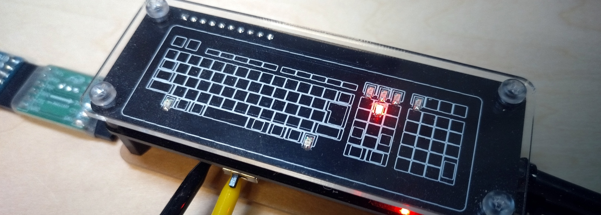
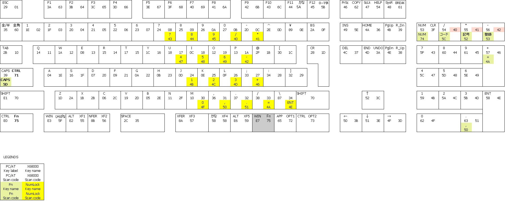
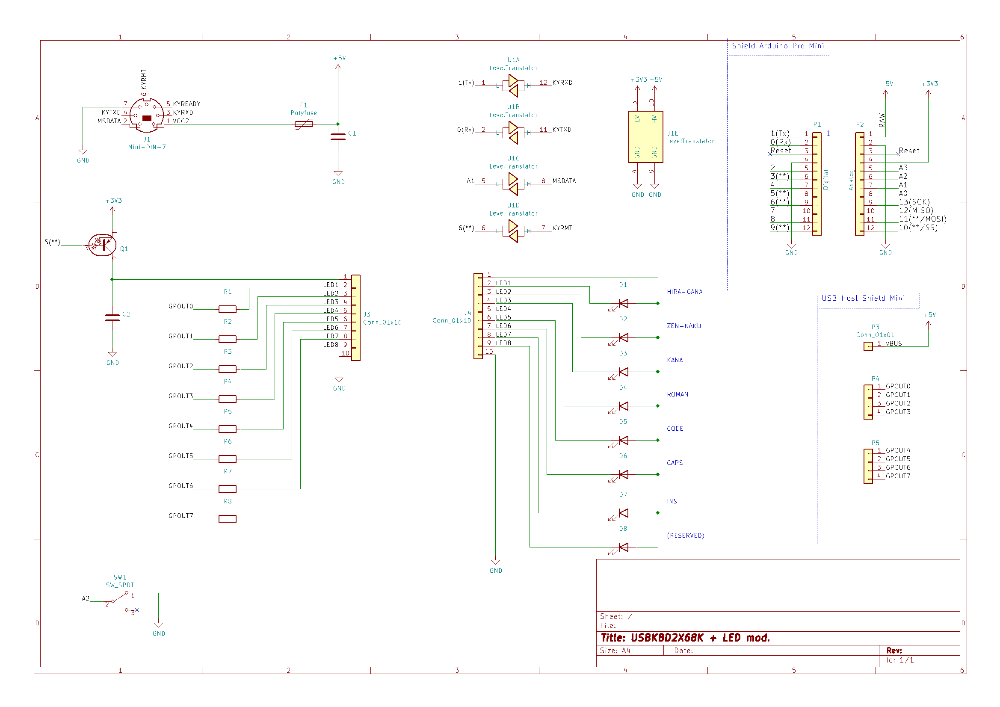

# USBKBD2X68K + LED mod


## What's this
たねけん氏(@taneken2000/[taneken](https://github.com/taneken))とzato氏(@z_alpha2/[ztto](https://github.com/ztto))による[USBKBD2X68K](https://github.com/taneken/USBKBD2X68K)を元に、
がぶがぶ氏(@gabu_nyanco)、ましろん氏(@masiron203)、zato氏が追加したようなキーロック状態LEDを盛り込んだ改変版です。

## おことわり
全てのUSB機器に対して確認が取れているわけではありません。
いわゆる相性問題等で動かないものも多数ありますのでご了承ください。

また、以下のような機器は決して接続しないでください:
- ゲーミングキーボード
- 静電容量式スイッチを採用したキーボード
- PS/2-USB変換等、本機以外の変換機や切替器
- バスパワーUSBハブ

例によって完全無保証です。  
他の方のアレの方が良かった、大切なX680x0が壊れた、などといわれても何もできません。  
これを使う/使わないを判断する最終責任は貴方にあります。  
そして、その結果が意図しないものであったとしても、同様にその責は貴方自身が負うことになります。

## 特徴
- キーロック状態LED
- キーリピート開始待ち時間とキーリピート間隔を実機同様に設定可能
- 能動素子のコストだけで見るならArduinoベースかつLED付き変換機の中では最安
- テレビコントロールが可能
- X68000 Z付属キーボードのキーバインドおよびLED制御に対応

## 弱点
- オリジナルのUSBKBD2X68K(V0.4)と端子の割り当てが異なる
- キーバインド変更やマウスの移動速度変更にはソースの変更が必要
- 実機での動作実績に乏しい
- 機構部品のコストまで含めると世界で5番目くらいに高い
- 作者のプログラミング能力と視力と作業環境と口座残高に深刻な問題がある

その他既知の不都合については[issues](./issues)や[BUGS.md](./BUGS.md)を確認ください。

## 設定変更方法
### キーリピート開始待ち時間、および、キーリピート間隔の変更  
以下のいずれかを行うことで`switch.x`での設定が反映されます。
- X680x0本体の再起動を行う
- 拙作[`key_rep`](https://github.com/kani7/key_rep/)を実行する
- (X68030の場合)本回路を一旦取り外して、再度接続する
- (X68030の場合)本回路に搭載されたArduino上のRESETボタンを押す

### マウスの移動速度の変更  
ソース前半部の
```
const int16_t MOUSE_DIVIDER = 2;
```
の値を1以上の整数で指定してください。  
大きくするほど反応が鈍くなります。推奨値は4以内。  

### LEDの輝度変更  
拙作[`led_dim`](https://github.com/kani7/led_dim/)で変更するか、
ソース前半部の
```
const uint8_t LED_PWM[4] = {0, 0xc0, 0xf0,  0xfc};
```
の配列内の値を0～254の整数で指定してください。
値が大きくなるほど暗くなります。

## キーバインド
### 日本語109キーボードの場合


メインキーとカーソル移動周りは日本語109キーボードと同じ刻印、同じ動作をするキーを割り当てていますが、特に最下段(スペースキーの左右)のキーについてはほぼ別物になっています。  
必要に応じてキートップにステッカーを貼るなどすると良いでしょう。

プログラムの処理としてはFnキーの押下状態およびNUM Lockの状態の組み合わせで最大4通りのキーバインドを切り替える仕組みになっています。

Fnキーを途中で離すと意図しないスキャンコードが送出されるという考慮漏れがあります。
詳細は[BUGS.md](./BUGS.md)を確認ください。

### X68000 Z付属キーボードの場合
キーの刻印通りになるよう割り当ててあります。  
なお、以下の注意事項があります。
- キーボード裏面のスイッチは`X68`側にしてください。
- USBホットプラグには対応していません。
- USB HubやUSB切替器、KVMスイッチを経由して接続した場合は動作しません。

### テレビコントロールについて
純正ディスプレイテレビの各種操作が可能です。キー割り当てについては[tvcode.h](./tvcode.h)を確認ください。  
SHIFTキーのみに反応するか、OPT.2キーにも反応するかの切り替えは`switch.x`の指定に従います。

## 回路図
以下の回路図ではArduino Pro Mini(ATmega328P)の3.3V 8MHz版を想定しています。


### 回路製作時の留意点
- 電源電圧に関係なく、USB host shieldのGPOUTおよびGPINは3.3V系です。  
  **5V系I/Oは決してつながないで**ください。
- LED電流は**1本当たり20mA未満を厳守**してください。
  これを少しでも超えるとUSB host shieldに致命的な損傷ないし回復不能な劣化が生じます。  
  屋内で使うものですから、定格目一杯でギンギンに光らせるものでもないでしょう。
- LED電流の**合計は60mA程度に収まるよう**にしてください。  
  あまり多いとArduino やUSB host shieldの動作に影響します。  
  X680x0のキーボード電源には余裕がない(後述)ことに留意してください。
- 当然ですが、LEDの輝度変更に用いる素子(Q1)のファンアウトは上記LED電流の合計を十分上回っていなければなりません。
- 3.3V系/5.0V系の信号レベル変換はAE-LCNV4-MOSFET(K-13837)または互換品を想定しています。  
  少なくとも`MSDATA`信号線についてはオープンコレクタ出力またはオープンドレイン出力である必要があります。
- 上記以外は注意点も含めてオリジナルのUSBKBDX68Kと同じです。  
  - プログラムの規模の都合でATmega328Pが必要です。ATmega168Pでは書き込めません。
  - USB mini host shieldは**VBUS周りの改造が必要**です。改造し忘れた場合、USBコネクタに接続したキーボードが動きません。
  - プログラム書き込みアダプタの電源を3.3Vにしておかないと、USB mini host shieldに致命的な損傷が生じます。

### 各部の意味
- D1～7(LED)  
  D1から順に ひらがな、全角、かな、ローマ字、コード入力、CAPS、INS です。
- SW1(`A2`を`GND`に落とすスイッチ)  
  本回路に接続されたマウスを使用するか否かを切り替えます。  
  X680x0本体のマウスポートとUSBマウスは同時には利用できません。

## スケッチ(プログラム)のビルド
Arduino IDEのライブラリマネージャから以下のライブラリを取得した後、スケッチをビルドしてください。
- USB_Host_Shield_2.0  
	https://github.com/felis/USB_Host_Shield_2.0

Arduinoのモデル名やクロックは間違えないようにしてください。  
頒布した版では上述の通り、Arduino Pro Mini(ATmega328P)の3.3V 8MHz版を使用しています。

### スケッチ書き込み時の注意
スケッチ書き込み時は必ず本回路をX680x0から取り外してください。  
書き込みに失敗するだけでなく、X68000の故障の原因となります。

## 消費電力についての参考情報
ご存知の通り、Compact 型を除くX680x0本体は電源がOFFの間もキーボードに対して給電しています。
この常駐電源は今時の電源に比べて非常に貧弱です。  
なお、[純正のキーボードは最大でも63mAしか消費しない](https://twitter.com/haru_ino/status/1360766283780816898)そうです。

本回路はUSBキーボードを外した状態かつLEDを全て消灯した状態で15mAを消費します。  
更にLEDとUSBキーボードの電流が上乗せされますから、余裕はありません。

事前にUSBキーボードの消費電流を測定するくらいの慎重さが必要でしょう。

## ハードウェアの頒布について
キットや基板などの部材形式での頒布を行う予定はありません。  
- LED基板の歩留まりが(シルク印刷不良やレジストの気泡などの理由で)1/3未満と異常に悪い
- 元々自分用に作ったものであり、バグ取りが不十分

と言った理由によるものです。

組み立て済みハードウェアについては極少数を頒布するかもしれません。


## 謝辞
- [がぶがぶ様(@gabu_nyanco)の動画](https://twitter.com/gabu_nyanco/status/1343879814311133184)を見たことがそもそもの切っ掛けでした。  
  氏の投稿を見なければ、何かしようとは思わなかったでしょう。

- たねけん様(@taneken2000)がUSBKBD2X68Kのソースコードを開示されていたからこそ、私のような素人でもここまで辿り着けたといえます。

- zato様(@z_alpha2)からは数々の助言とひらめきをいただきました。

- 開発のほとんどの段階において、XM6 TypeGを使用させていただきました。
  PI.様、GIMONS様をはじめとする開発者の皆様に感謝いたします。

- キーリピートの挙動についてはかまだ様(@kamadox)から助言をいただきました。  
  また、氏の作成された数々の資料、特に[X680x0 の未公開機能](https://stdkmd.net/udcx68k/)や[KeyWitch総合マニュアル](http://retropc.net/x68000/software/system/key/keywitch/keywitch.htm)
  にも大変助けられました。

- NUM Lockの挙動についてはAwed様(@Awed_Urshy)、issaUt様(@issaUt)、かまだ様から情報をいただきました。
  もし今も挙動が変であるならば、私の質問の仕方が悪かったか、私のプログラミング能力に問題があるかのどちらかです。

- Aruduinoのピン割り当ての変更を決意したのはましろん様(@masiron203)の助言によるものです。  
  SoftwareSerialの不安定な挙動を知ることがなければ、相当な遠回りをしていたことでしょう。

- USB host shieldに関しての情報は
  [DEKO 様のページ](https://ht-deko.com/arduino/shield_usbhost_mini.html)
  が大変参考になりました。  
  注意書きを見落としていたら、私はいくつかの部品を無駄に壊していたことでしょう。

- テレビコントロール関連については、
  [まごの手本舗](http://www.tsp.ne.jp/~sawada/mago/)様が公開されている資料を利用させていただきました。  
  また、立花@桑島技研(@kg68k)様には
  [X68kのIOCSを解析](https://kg68k.github.io/InsideX68000-eratta/InsideX68000.html#p366_z20)
  していただくというお手数をおかけしてしまいました。

- 実キーボードにおける計測データについては、ハルぴこ(@haru_ino)様の情報を多く利用させていただいています。
  また、何度も助言をいただきました。

- X68000 Z用キーボードのLED制御についてはyunk(@yunkya2)様の[解析結果](https://github.com/yunkya2/x68kzkbd-pico)を利用させていただきました。

- 名前は伏せさせていただきますが、他にもX680x0コミュニティの少なくない方々からお言葉をいただきました。  
  皆様のお言葉が無ければ、LEDが灯ったあたりで開発は終了していた筈です。

- 回路図および基板データの作成には[KiCad](https://kicad.org/)を用いました。  
  この出来のCADが個人で手軽に使えるようになったのは素晴らしいことです。  
  プロジェクトに参画されている皆様に感謝します。  
  基板作成に用いたデータのいくつかはテキストエディタで作成/修正しており、
  データ仕様が全て公開されているのも有り難かったです。

## 夢の続きを語ろう
